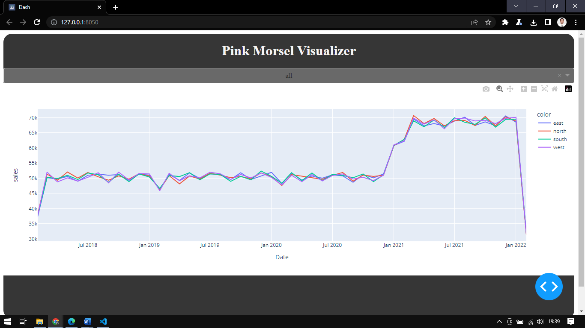

# Quantium - Software Engineering
## Virtual Experience Program on Forage [ Oct 2022]

## Objective
The project contains four main scripts:
- ingestCSV.py - It's a function to merge & process the csv file and write them into output.csv.
- app.py - to run ingestCSV.py
- dashApp.py - to visualize The Pink Morsel Sales  by date, sales, and region using Dash Framework
- testsDashApp.py - to test the functionality of the app.

<br>

## Usage
1. You Can Run Formatscript.Py To Process The Data But It Is Already Processed So You Can Directly Go To The Next Step.

    Clone the repo and install dependencies with python package manger pip.

    ```bash
    git clone https://github.com/ardmuh/quantium-software-engineering.git
    cd quantium-starter-repo/
    pip install -r  requirements.txt
    ```

2. Run the following command, for data processing and combine all csv files

    ```bash
    python app.py
    ```

3. Run the following command,c

    ```bash
    python dashApp.py
    ```

4. FInally, open this [http://127.0.0.1:8050/](http://127.0.0.1:8050/) on any browser you like.

<br><br>
Looking forward to hearing your feedback..

<br><br>
## Screensots from the Project
|  |
